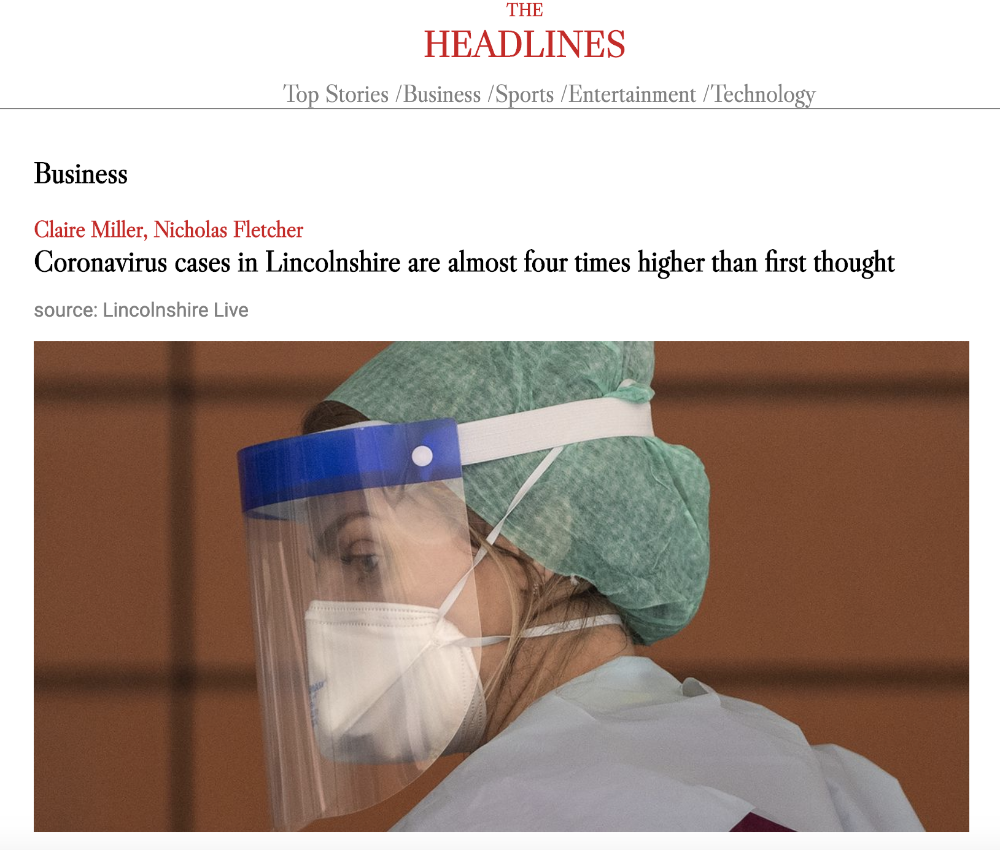
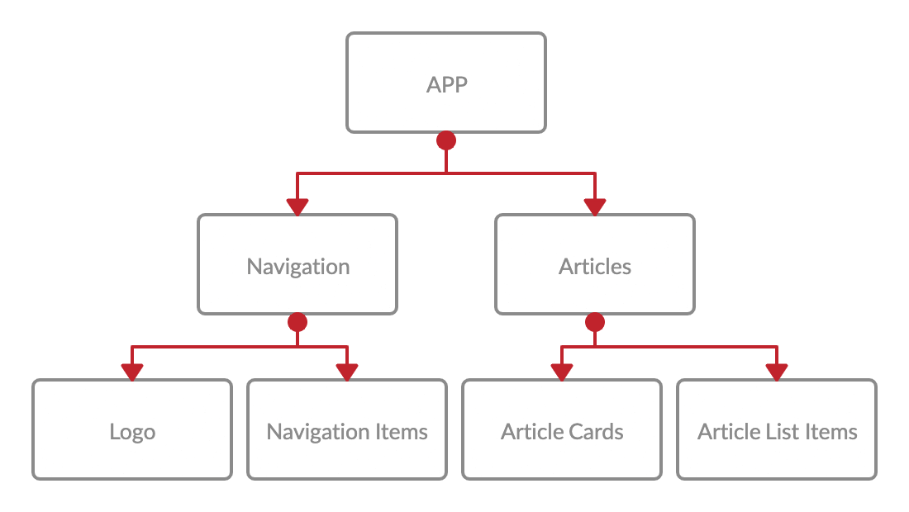

# The Headlines
See the UK top headlines in one place with The Headlines. The Headlines uses the NewsAPI to display the top headlines, arranged in a stylish and digestible format, allowing you to quickly see the top news stories happening today.




## Quick Start
To run locally, you will need an api key from [NewsAPI](https://newsapi.org/). Fork and clone this depository and install dependencies:
```
npm install
```
Create an .env file in the root directory and add your api key to this file
```
REACT_APP_API_KEY=<api_key>
```
Start the server:
```
npm start
```
Run the tests:
```
npm test
```

## Application Design
This application was designed using ReactJS. A TDD process was followed using the testing frameworks Jest and Enzyme.

The components have been arranged in the following structure:


A key goal for this application was to make the design responsive for difference screen sizes. This was achieved by designing the layout based on the smallest screen size then adjusting for larger screen sizes.

## Future Developments

### Appearance
- Highlight in black the navigation item that is currently selected
- Make the height of the top 3 articles responsive so that the height gets smaller as the screen gets smaller. At the moment the gap between these articles widens as the screen gets smaller.
- Add grey line break between the top 3 articles
- Make the 2nd & 3rd articles smaller and appear side-by-side to emphasis the top story a bit more

### Features
- When screen-size is small, navigation bar should be swapped for a burger menu which opens up a side drawer with the navigation items in a list
- When screen size is large, the main article should contain either the content or description (whichever has text, prioritising content) underneath the image
- Each article should contain a link to the full article to allow users to read it. It could be the entire card/list item that's clickable (in which case onhover effects should be added), or the title and/or a specific link added with the text "Continue reading at <source>"
